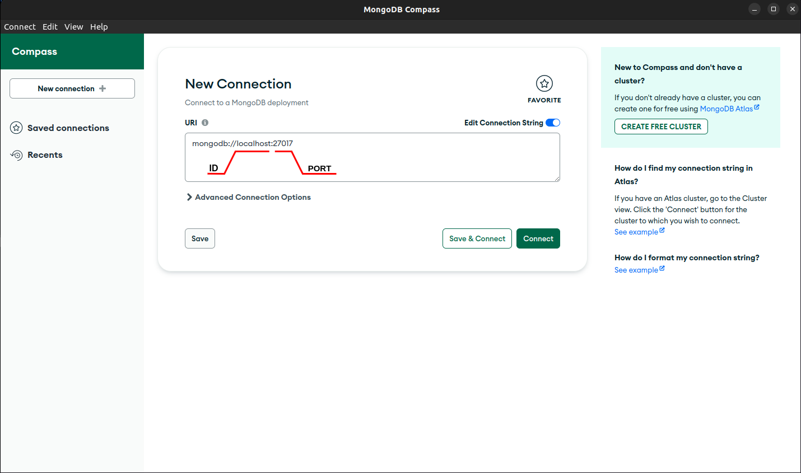

Table of contents
================

<!--ts-->
- [Table of contents](#table-of-contents)
- [Introduction](#introduction)
- [Installation](#installation)
- [Usage](#usage)
  - [Example connection](#example-connection)
  - [Mongo Compass](#mongo-compass)
- [Documentation](#documentation)
- [Author](#author)
- [License](#license)
<!--te-->

Introduction
============
MongoDB is a popular NoSQL database that offers flexibility and scalability, but it can be difficult to work with due to its complex query language and lack of a clear schema. Pymongo was created to address the challenges that developers face when working with MongoDB databases. Kimongodb is a document that teaches you how to install and use data queries using the Pymongo library.

Installation
============

This tutorial installs MongoDB 6.0 Community Edition. To install a different version of MongoDB Community, use the version drop-down menu on this [document](https://www.mongodb.com/docs/manual/tutorial/install-mongodb-on-ubuntu/).

Clone repo and install MongoDB and requirements.txt in a Python >=3.7 environment.

```bash
git clone https://github.com/kirinslab/kimongodb.git
cd kimongodb
pip install -r requirements.txt
cd script
sudo chmod a+wrx .
./install.sh
```

Usage
=====

Example connection
------------------
```python
import pymongo

# Establish a connection to MongoDB
try:
    client = pymongo.MongoClient("mongodb://localhost:27017/")
    print("Connected successfully to MongoDB!")
except pymongo.errors.ConnectionFailure as e:
    print("Could not connect to MongoDB: %s" % e)

```
output
```jyputer
Connected successfully to MongoDB!
```

Once you've got MongoDB and Pymongo set up. You can also try out most of the tasks by running the [examples](example).

Mongo Compass
-------------

MongoDB Compass is a powerful GUI for querying, aggregating, and analyzing your MongoDB data in a visual environment.


For all information using Mongo Compass, please see the [Documentation](#documentation) section.

-------

Documentation
=============

- <a href='https://www.mongodb.com/docs/manual/'> MongoDB Manual </a>
- <a href='https://www.mongodb.com/docs/compass/current/connect/'> MongoDB Compass </a>


Author
======

```
cedricnam: mnnam132@gmail.com
```
License
=======

Copyright (c) Kirinslab. All rights reserved.

Licensed under the [GPT-3](LICENSE) license.
